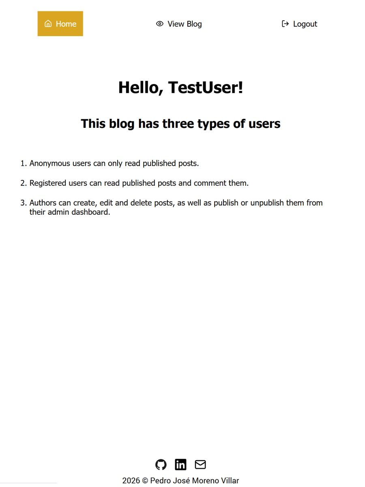
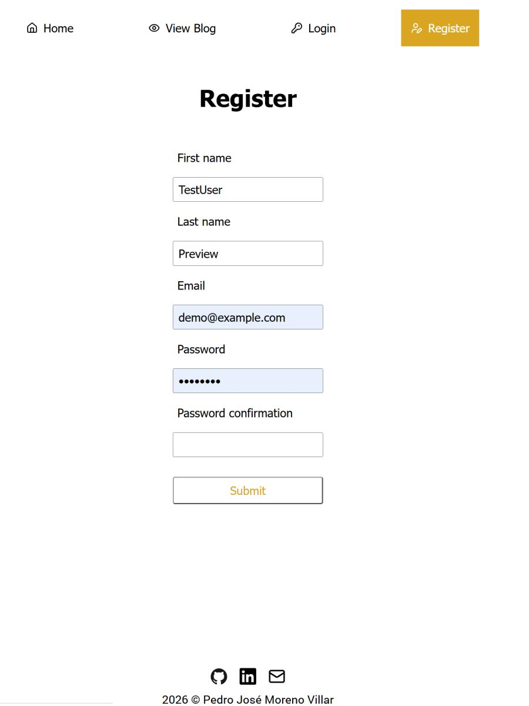
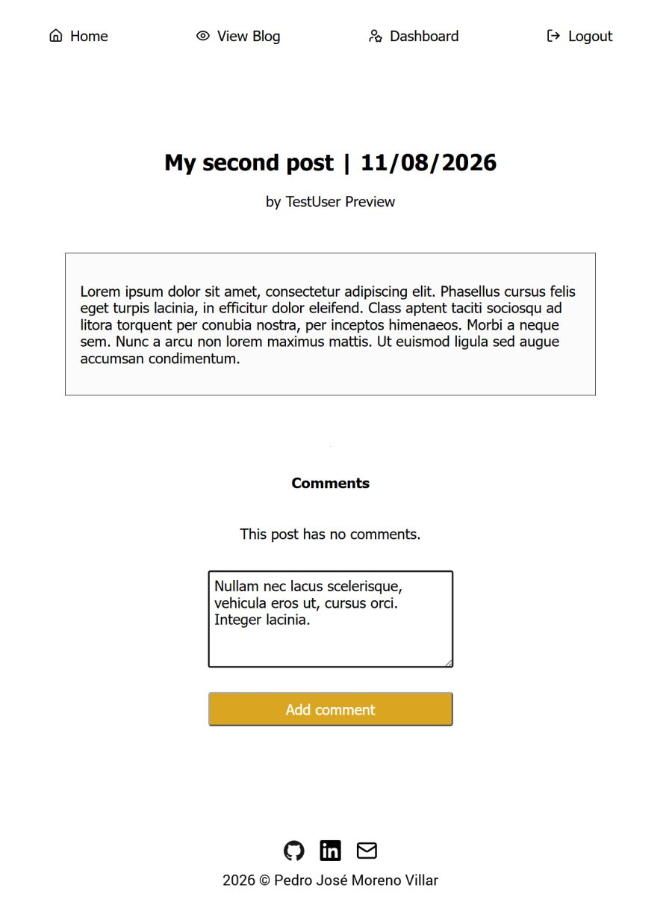
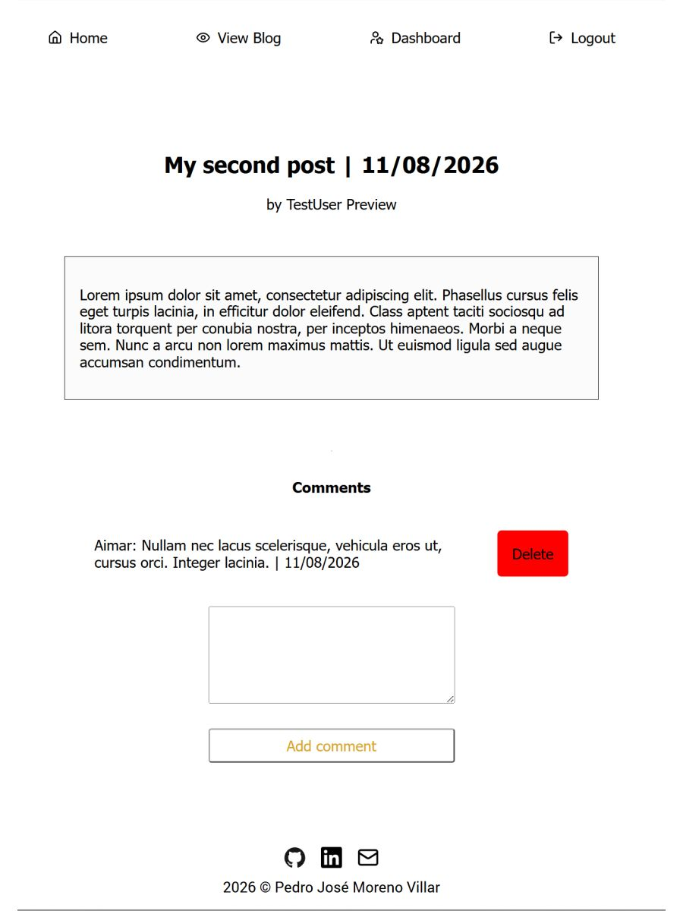

# Blog API

An API that serves as backend for a small blog website. It handles user registration and login, as well as CRUD operations on blog posts and blog comments. It serves two frontend clients: a public one that caters anonymous and registered users and an admin one for posts authors. The main focus is backend reliability: authentication, authorization, validation, token management and database access through Prisma ORM.

## Screenshots

| <br>Home           | <br>Register     | <br>Log in                  | <br>New post                  |
| ----------------------------------------------------------- | ------------------------------------------------------------- | --------------------------------------------------------------------- | -------------------------------------------------------------------------- |
| <br>Dashboard | <br>View posts | <br>Comment post | <br>Delete comment |
|  |

## Live Demo

[View Live Demo](https://blog-public-client-d222d34a08ef.herokuapp.com/)

## Demo account

To explore the application without creating a new account:

```bash
Email (username): demo@example.com
Password: demo1234
```

## Features

## Technical highlights

## Tech Stack


## How to run locally

1. Install dependencies with `npm install`
2. Create a `.env` file with the required variables detailed in `.env.example`
3. Run `npm run prisma:migrate` and `npm run prisma:generate`
4. Start the app with `npm run start`

## Architecture

```bash
.
├── server.js                  # Express application setup
├── config/                    # Passport configuration
├── controllers/               # Request handlers
├── db/                        # Prisma query modules
├── lib/                       # Prisma and Cloudinary configuration
├── middleware/                # Authentication middleware
├── prisma/
│   ├── migrations/
│   └── schema.prisma          # Database schema
├── public/                    # CSS and README assets
├── routes/                    # Express route definitions
├── utils/                     # Helper utilities
├── package.json
└── README.md
```

## Project context

This project is based on [The Odin Project’s Blog API assignment](https://www.theodinproject.com/lessons/node-path-nodejs-blog-api). I kept the UI intentionally simple so the backend and data flow are the main focus.
