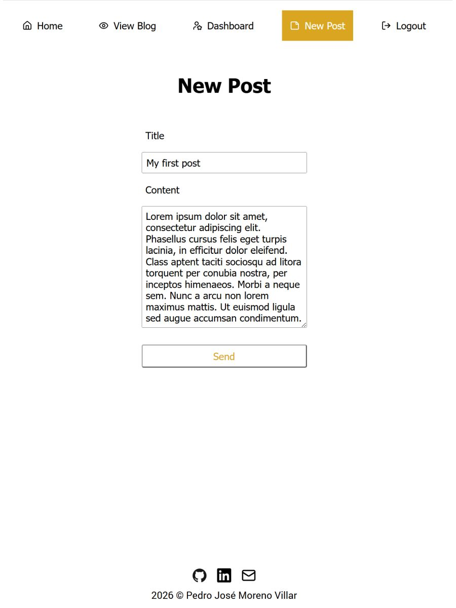

# Blog API

REST API powering a full-stack blog platform with separate public and admin React clients. Implements JWT authentication with Passport, role-based access control, server-side validation, and database abstraction via Prisma.

[Live Demo](https://blog-public-client-d222d34a08ef.herokuapp.com/) | Demo: `demo@example.com` / `demo1234`

See: [Public Client](https://github.com/pedromorenovillar/blog_public-client) • [Admin Client](https://github.com/pedromorenovillar/blog_admin-client)

| <br>Log in | <br>Dashboard | <br>View posts | <br>New post |
| ---------------------------------------------------- | ----------------------------------------------------------- | ------------------------------------------------------------- | --------------------------------------------------------- |

## Features

- **Separated concerns**: Database queries isolated in `/db` modules; controllers focus on HTTP logic
- **Ownership enforcement**: Middleware-based resource access control; users can only modify their own posts/comments
- **Validation-first**: Server-side validation with express-validator prevents invalid data from reaching the database
- **Token-based authentication**: Short-lived JWT access tokens with refresh tokens stored securely as hashed values in the database

## Tech Stack

- **Frontend**: React, Vite
- **Runtime**: Node.js, Express
- **Database**: PostgreSQL, Prisma
- **Authentication**: JWT, Passport.js, bcryptjs
- **Validation**: express-validator

## Setup

```bash
npm install
cp .env.example .env          # Fill in environment variables
npm run prisma:migrate
npm run dev
```

## Project Structure

```bash
.
├── server.js                  # Express application setup
├── config/                    # Passport configuration
├── controllers/               # Request handlers
├── db/                        # Prisma query modules
├── lib/                       # Prisma configuration
├── middleware/                # Authentication middleware
├── prisma/
│   ├── migrations/
│   └── schema.prisma          # Database schema
├── routes/                    # Express route definitions
├── validators/                # Route validators
└── utils/                     # Helper utilities
```

## Project context

Built as part of The Odin Project's NodeJS curriculum [The Odin Project’s Blog API assignment](https://www.theodinproject.com/lessons/node-path-nodejs-blog-api). The assignment required separate public and admin clients; this implementation uses React clients backed by a shared Express REST API.
