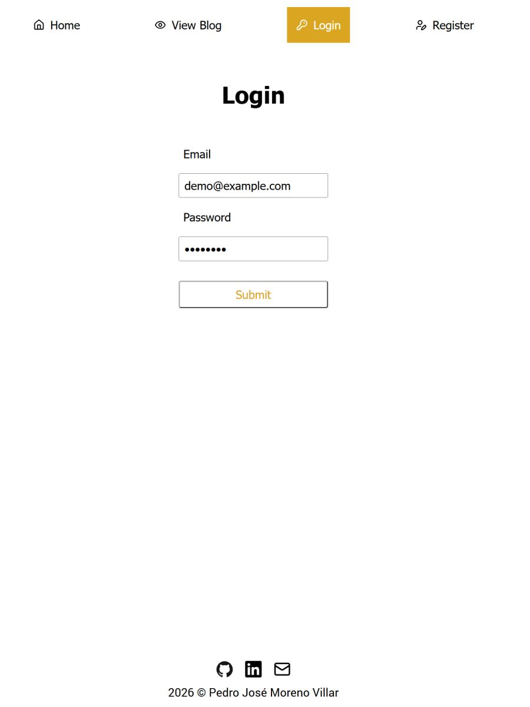
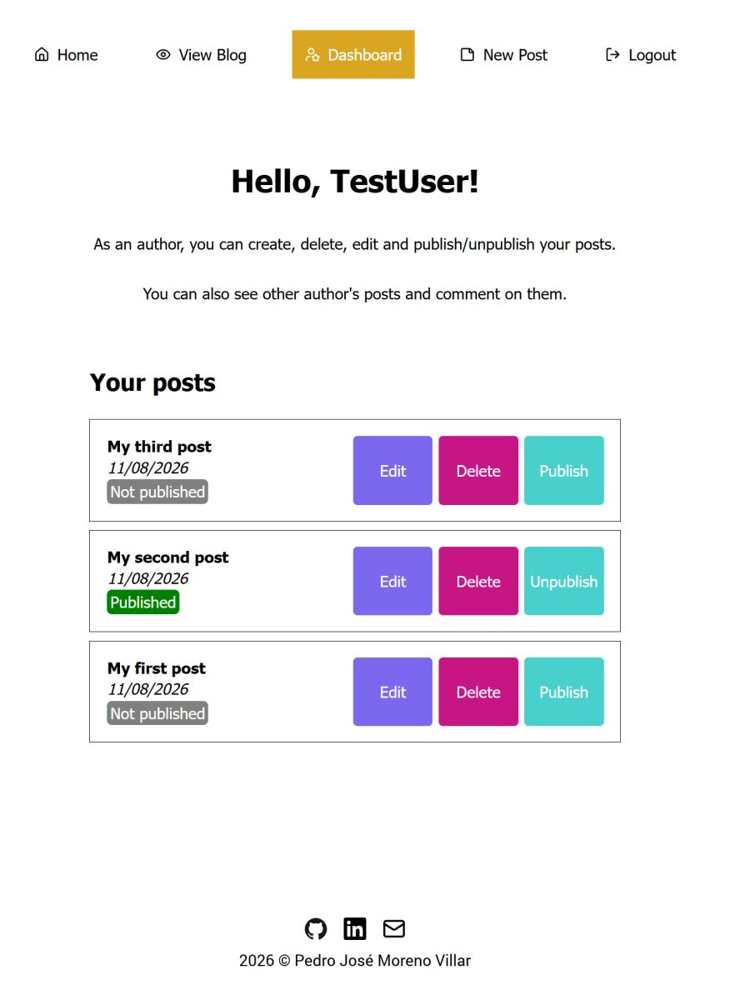
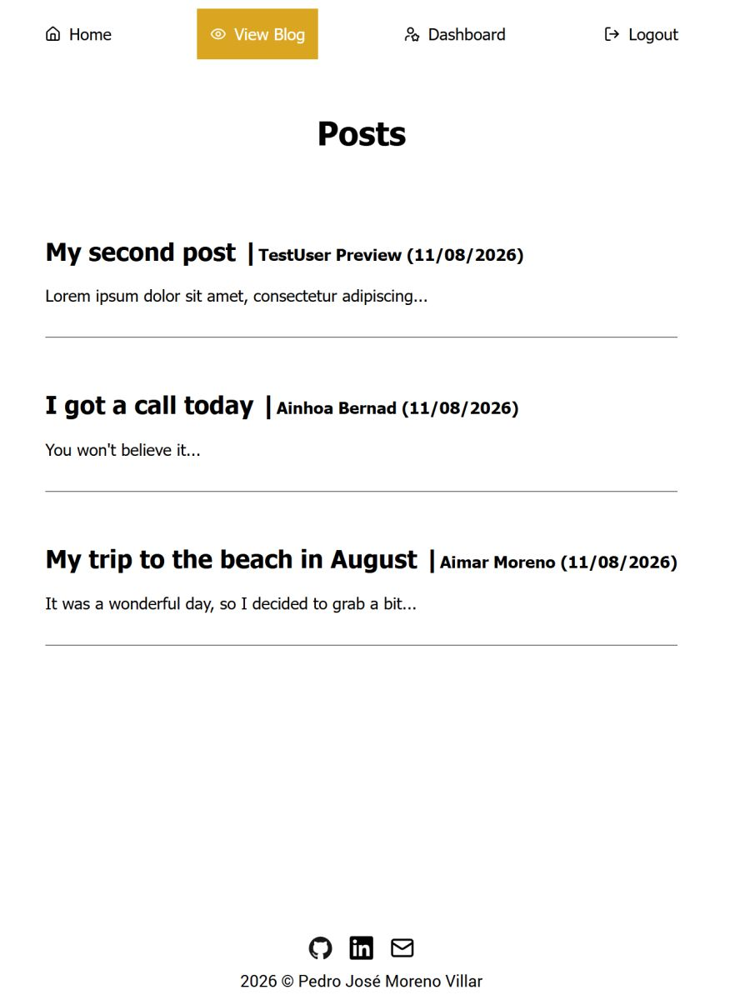
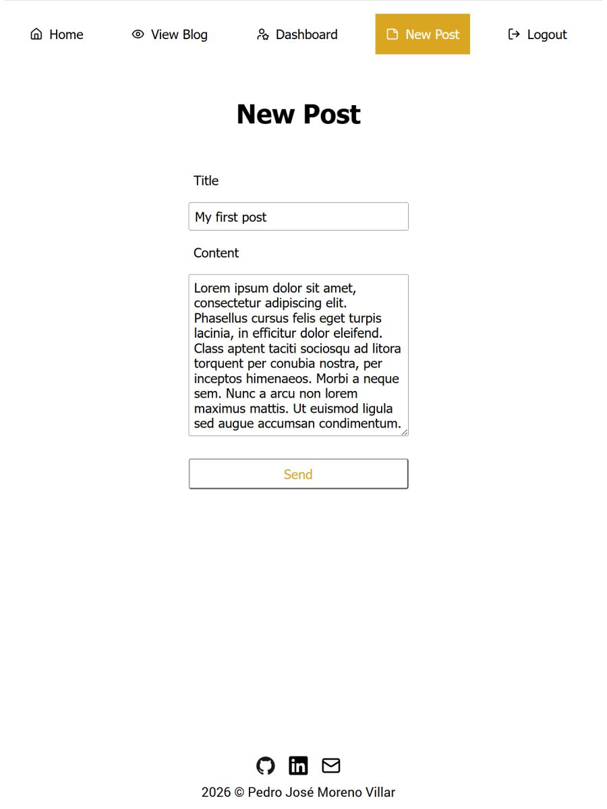
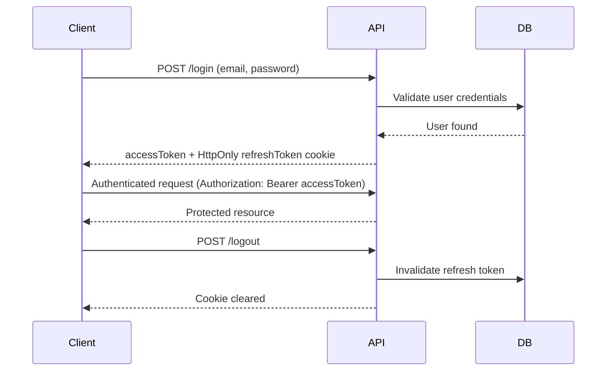

# Blog API

REST API powering a full-stack blog platform with:

- Public and admin React clients

- Secure JWT authentication with refresh tokens

- Role‑based access control

- Strict server‑side validation

- Prisma ORM + PostgreSQL

- Integration tests (Jest + Supertest)

- Clean architecture (controllers → services → db)

This README includes technical details for reviewers.

[Live Demo](https://blog-public-client-d222d34a08ef.herokuapp.com/) | Demo: `demo@example.com` / `demo1234`

See: [Public Client](https://github.com/pedromorenovillar/blog_public-client) • [Admin Client](https://github.com/pedromorenovillar/blog_admin-client)

| <br>Log in | <br>Dashboard | <br>View posts | <br>New post |
| ---------------------------------------------------- | ----------------------------------------------------------- | ------------------------------------------------------------- | --------------------------------------------------------- |

## Features

- **Separated concerns**: Database queries isolated in `/db` modules; controllers focus on HTTP logic
- **Ownership enforcement**: Middleware-based resource access control; users can only modify their own posts/comments
- **Validation-first**: Server-side validation with express-validator prevents invalid data from reaching the database
- **Token-based authentication**: Short-lived JWT access tokens with refresh tokens stored securely as hashed values in the database
- **Integration testing**: Jest and Supertest tests cover API endpoints, authentication, authorization, database mutations, and password hashing

## Tech Stack

- **Frontend**: React, Vite
- **Runtime**: Node.js, Express
- **Database**: PostgreSQL, Prisma
- **Authentication**: JWT, Passport.js, bcryptjs
- **Validation**: express-validator
- **Testing**: Jest, Supertest

## Setup

```bash
npm install
cp .env.example .env          # Fill in environment variables
npm run prisma:migrate
npm run dev
```

## Project Structure

```bash
.
├── server.js                  # Express application setup
├── config/                    # Passport configuration
├── controllers/               # Request handlers
├── db/                        # Prisma query modules
├── lib/                       # Prisma configuration
├── middleware/                # Authentication middleware
├── prisma/
│   ├── migrations/
│   └── schema.prisma          # Database schema
├── routes/                    # Express route definitions
├── validators/                # Route validators
└── utils/                     # Helper utilities
```

## Testing

Integration tests are written with Jest and Supertest and run against a dedicated test database.

The test suite covers:

- `GET /api/posts` returns only published posts
- `POST /api/users/register` creates a user with a hashed password
- Unauthenticated users cannot create posts (`401`)
- Authenticated authors can create posts
- Authenticated non-authors cannot publish posts (`403`)

The schema can be prepared with:

```bash
npm run migrate:test
```

Run the test suite with:

```bash
npm test
```

## Logs & Debugging

The API includes basic logging for debugging and development:

- Request logging via Morgan (`dev` format)
- Authentication events (user registration, login, logout)
- Important actions (post creation, update, delete, publishing/unpublishing, comment creation, update and deletion)
- Error logging through the global error handler

## Validation

The API uses **express-validator** to enforce strict input validation across all endpoints.

### Authentication validation

- Email format
- Email uniqueness
- Password length
- Password confirmation
- Normalization (`trim`, `toLowerCase`)

### Post validation

- `title`: required, trimmed, max 100 chars
- `content`: required, trimmed, max 3000 chars
- `id`: must be a positive integer

### Comment validation

- `content`: required, trimmed, max 3000 chars
- `postId`: must be a positive integer
- `id`: must be a positive integer

Validation errors return:

```json
{
  "errors": [
    {
      "msg": "Content is required.",
      "param": "content",
      "location": "body"
    }
  ]
}
```

## Authentication Flow


```mermaid
sequenceDiagram
  participant Client
  participant API
  participant DB

  Client->>API: POST /login (email, password)
  API->>DB: Validate user credentials
  DB-->>API: User found
  API-->>Client: accessToken + HttpOnly refreshToken cookie

  Client->>API: Authenticated request (Authorization: Bearer accessToken)
  API-->>Client: Protected resource

  Client->>API: POST /logout
  API->>DB: Invalidate refresh token
  API-->>Client: Cookie cleared
```

## Error Handling

The API includes a global error handler that:

- Logs errors internally
- Returns consistent JSON responses
- Prevents leaking internal details

Example error response:

```json
{
  "message": "Post not found"
}
```

Example internal log:

```
[ERROR] Error: Post not found
```

## Example Endpoints

### Create Post

**Request**

```http
POST /api/posts
Authorization: Bearer <token>
Content-Type: application/json

{
  "title": "My first post",
  "content": "Hello world!"
}
```

**Response**

```json
{
  "id": 12,
  "title": "My first post",
  "content": "Hello world!",
  "authorId": 1
}
```

---

### Create Comment

**Request**

```http
POST /api/comments
Authorization: Bearer <token>
Content-Type: application/json

{
  "postId": 12,
  "content": "Nice post!"
}
```

**Response**

```json
{
  "id": 55,
  "postId": 12,
  "content": "Nice post!",
  "authorId": 1
}
```

## Project context

Built as part of The Odin Project's NodeJS curriculum [The Odin Project’s Blog API assignment](https://www.theodinproject.com/lessons/node-path-nodejs-blog-api). The assignment required separate public and admin clients; this implementation uses React clients backed by a shared Express REST API.
